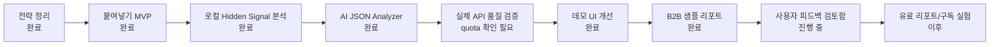

# Review Lens Roadmap

작성일: 2026-06-12

## 한 줄 방향

Review Lens는 번역기가 놓치는 해외 리뷰의 숨은 경고, 원어민 뉘앙스, 발음 기반 오탈자, 은어를 해석해 여행자 조언과 사업자 액션으로 바꾸는 도구다.

## 현재 위치

```text
아이디어 정리 -> MVP 골격 -> 로컬 분석 -> AI 분석 연결 -> 품질 검증/데모화 -> 사용자 검증 준비
                                                                   ^
                                                                   현재 여기
```

## 단계별 로드맵

| 단계 | 상태 | 목표 | 산출물 |
|---|---|---|---|
| 0. 전략 정리 | 완료 | 시장/제품 방향 결정 | `PROJECT_STRATEGY_REPORT.md` |
| 1. MVP 골격 | 완료 | 붙여넣기형 앱 구현 | Next.js app, `/api/analyze` |
| 2. 로컬 분석 | 완료 | 숨은 표현 사전 기반 분석 | `lib/hidden-signals.ts`, `lib/analyze.ts` |
| 3. AI 분석 연결 | 완료 | OpenAI JSON 분석 경로 추가 | `lib/ai-analyze.ts`, schema |
| 4. 품질 검증 | 진행 중 | 실제 API key로 결과 품질 확인 | 50-sample bank, quota blocked |
| 5. 데모 UI | 완료 | 처음 보는 사람도 바로 이해 | 예시 탭, confidence warning, Markdown download |
| 6. B2B 샘플 | 완료 | 호텔/게스트하우스 유료 리포트 느낌 | `/sample-report` |
| 7. 사업성 재검토 | 완료 | SaaS보다 B2C 무료 도구 + B2B 1회 리포트로 좁힘 | `BUSINESS_ANALYSIS.md` |
| 8. 사용자 검증 | 진행 중 | 여행자/B2B 반응 확인 | `/feedback` 로컬 검토함, CSV/JSON export |
| 9. 수익화 실험 | 예정 | 1회 리포트/월 구독 테스트 | B2B CTA, lead capture |
| 10. 운영 루프 | 진행 중 | 사용자가 상세 지시하지 않아도 다음 단계 선택 | `OPERATING_LOOP.md`, `npm run loop` |

## Mermaid Roadmap



## 우선순위 판단

### 지금 가장 중요한 것

1. OpenAI billing/quota 확인 후 3개 샘플 live smoke 재실행
2. `/feedback`에서 로컬 피드백을 CSV로 내려받아 실패 패턴 분류
3. 실제 OpenAI API key로 50개 샘플 분석
4. 배포 대상을 정한 뒤 lead/feedback capture를 localStorage에서 서버 저장으로 전환

### 자율 진행 규칙

사용자가 "다음으로 진행해줘"처럼 넓게 지시하면 `OPERATING_LOOP.md`를 먼저 읽고, 막힌 일은 보류한 뒤 repo 안에서 가능한 가장 높은 가치의 다음 작업을 수행한다.

### 아직 미루는 것

- Google OAuth
- DB 저장
- 결제
- scraping
- 자동 답글 게시
- 경쟁점 대량 분석

이유: 아직 핵심 가치 검증 전이다. 지금은 "붙여넣은 리뷰에서 숨은 뜻을 잘 찾아내는가"가 먼저다.

## 추적할 지표

초기에는 정량 지표보다 질적 피드백이 중요하다.

- 샘플 결과를 보고 "이거 신기하다" 반응이 나오는가
- 여행자가 예약 전 판단에 도움을 받는가
- 사업자가 "이건 우리 직원에게 공유할 수 있겠다"라고 느끼는가
- AI가 과해석하지 않는가
- evidence phrase가 실제 리뷰 근거로 충분한가

## 다음 업데이트 규칙

작업을 진행할 때마다 이 파일에서 아래 항목을 갱신한다.

- 단계 상태
- 이번 주 목표
- 완료/보류/방향 전환 이유
- 다음 3개 우선순위
